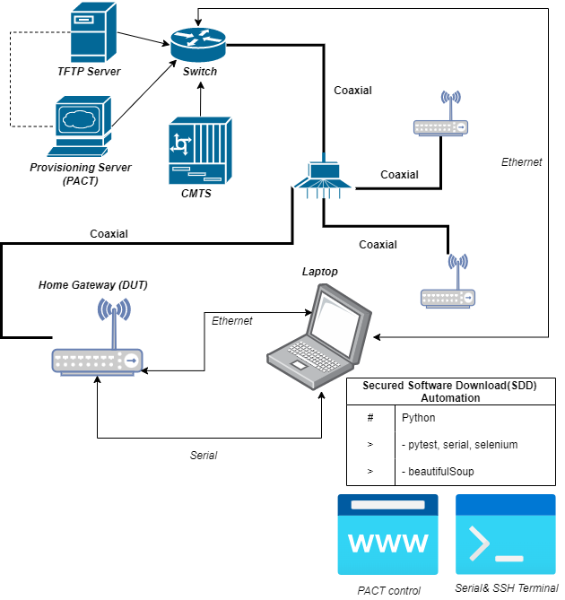

# Project: Secured Software Download Automation of Cable Modem
## Summary
Secured Software Download(SDD) is the mandatory way of Cable Modem products.
In the internal testing environment, if the software file is on the file management server (tftp), a configuration file which including the software information should be enrolled through a provisioning server (e.g. PACT).

And then the following steps to execute SSD are like below:
- Rebooting CM
- Monitoring of software downloading progress

Final software version should be checked after downloading and installation have finished.
Those steps also can be also done manually but those things are very inconvinient so some python scripts for automation of SDD have made. 
And plus these scripts could be enlarged for the other testing automation. 

## Simple Diagram

    
     
    

# Sequences
- Connect to RG terminal (SSH) and login to the terminal. On the terminal, CM serial console can be opend using some snmp cli. MobaXterm has used for connecting RG terminal.
- The COM port for CM serial will be found and CM serial terminal will be connected using the found CM port.
- The CM MAC like an unique ID of CM will be found to use it on PACT.
- CM version (software version) will be checked on the CM terminal. If the version is different when it compares to a target upgrade version, the scripts will be moved to the next step.
- The software version information which is shown in the configuration file on PACT also should be checked. If this version is not the same as the target upgrade information, the right configuration file located on the local path of a PC running these script should be enrolled on PACT newly. 
- Let the scripts make the DUT reboot and then do monitoring of the software download progress and installation. (In case of the normal state, the DUT will be rebooted automatically) 
- After the DUT booting finished, the comparision between the installed software verion and the target version should be done. If both values are equal, all steps have finished well.
